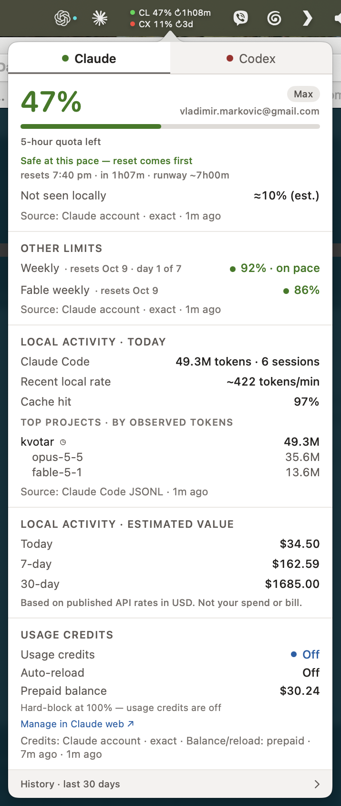

# Kvotar

**Will your quota last until reset?**

Kvotar is a native macOS menu-bar app that shows your remaining Claude and Codex quota and
estimates whether it will last until reset. See the readings behind its answer, get a warning
while you work, and understand where your local tokens went.

[Download the beta](https://kvotar.com/download) · [Getting started](#getting-started) ·
[Documentation](#documentation) · [Changelog](CHANGELOG.md)

**macOS 14 Sonoma or newer · Apple Silicon and Intel · No Kvotar account required**

Works with **Claude Code, Codex, or both**.



## Install

1. [Download the current beta](https://kvotar.com/download).
2. Unzip it and drag **Kvotar.app** into **Applications**.
3. Open Kvotar.

Release builds are signed and notarized. Kvotar checks for updates daily and installs an update
only when you click **Install**. You can turn off daily checks in the right-click menu.

## Getting started

Kvotar uses the sign-ins your tools already have on this Mac. You do not enter a password or API
key into Kvotar.

| Tool | What you need | What Kvotar shows |
|---|---|---|
| Claude Code | Claude Code signed in with your subscription | Account limits and resets, usage credits where available, and local Claude Code activity |
| Codex | Codex signed in with your ChatGPT account | Account limits and resets, credits or monthly limits where available, and local Codex activity |

The limits shown depend on what your provider reports for your plan. Kvotar follows one account
per tool: the account currently signed in on this Mac. It does not track API-key billing.

- **Look for `CL` and `CX` in the menu bar.** These are Claude and Codex. The percentage is quota
  **left**; the time shows a reset or an estimated time until it runs out.
- **Click to see the details.** Hover over figures for explanations. Click an underlined pace
  verdict to see the readings and calculation behind it.
- **Right-click for settings.** Choose notification groups under **Notify me**, enable
  **Open at Login**, or open History.

If a tool is not found, open it and sign in there. Kvotar detects its sign-in automatically.
If you cannot find the menu-bar item, open Kvotar again from Applications to bring up its window.

## How Kvotar helps

- **Keep your limits in view.** The menu bar shows quota left and a reset or runway clock. Open
  the popover for the account's other limits: weekly, monthly and per-model, where available.
- **Get time to react.** Pace estimates and optional notifications help you notice when usage
  may exhaust a limit before reset, so you can decide whether to slow down or defer work.
- **Understand the answer.** The explanation behind a pace verdict shows the figures and
  comparison that produced it.
- **Catch up after a break.** When there is a meaningful change, a line at the top of the tab
  tells you what changed since your previous look.
- **Understand where your tokens went.** Today's local activity shows projects and models,
  token counts and estimated value at published API prices.
- **Look back at your week.** History brings together a weekly recap, quota history, local
  usage breakdowns and recorded hard blocks, across a 30-day view.

> **Illustrative example:** You have about 40 minutes of estimated runway, but the limit resets
> in 1 hour 52 minutes. If that limit blocks further requests, continuing at the same pace could
> leave you waiting about 72 minutes. An early warning gives you time to adjust. Runway changes
> with usage; it does not predict when your task will finish.

History answers questions such as: *Which projects used the most tokens? How much quota was left
at reset? When did I hit a limit?* Weekly recaps cover completed Monday–Sunday weeks and link to
the records behind their observations.

## Understanding the numbers

**Account quota and local activity have different coverage.** The provider's quota can include
usage elsewhere on the account. Local breakdowns cover only the activity recorded on this Mac.

**Runway needs enough readings.** Kvotar estimates it from recent quota changes. A missing
estimate does not mean you have unlimited quota.

**Estimated token value is not your bill.** Published API prices put local token use in
perspective; the result is not your subscription charge, actual spending or money saved.

**History depends on what was recorded.** Local usage can be recovered from existing session logs.
Quota history builds while Kvotar is running. The 30-day view is a reporting period, not a
data-deletion schedule. See [storage and retention](docs/spec/storage.md).

## Privacy

Your usage history stays on your Mac. Kvotar has no analytics, telemetry or crash reporting.

- Kvotar reads your existing credentials. It never writes to the Keychain or your tools' sign-in
  files, never refreshes a token, and never asks another program to refresh one.
- Session logs provide token counts, model names, timestamps and project folders. Kvotar never
  stores your prompts, code, transcripts or tool output, and never copies the session files.
- Kvotar keeps its own data in `~/Library/Application Support/Kvotar` and its logs in
  `~/Library/Logs/Kvotar`.

Network use is limited to your providers' services, update checks, and links you choose to open.
Claude quota comes from `api.anthropic.com`; Codex quota comes through the local
`codex app-server`, with `chatgpt.com` as a fallback. Update checks go to
`updates.kvotar.com`: they include the app version, and the server sees your IP address and the
request time. Your usage is not uploaded.

**Save Diagnostics…** creates a zip on your Desktop and sends nothing. Even an ordinary bundle
contains logs with local folder paths. Extended diagnostics require your consent for up to
24 hours; an extended bundle includes a copy of the database with account details and usage
history. Review a bundle before sharing it, and never attach one to a public issue.

Read [credentials and privacy](docs/credentials-and-privacy.md) for the full data, network and
diagnostics details, including how to remove Kvotar's data.

## Help

**Claude sign-in expired?** Open Claude Code so it can renew its own sign-in. If Claude Code asks
you to sign in again, do that there. Kvotar picks up the renewed credential on a later check.

**Looking for settings or the welcome walkthrough?** Right-click the menu-bar item. In the
Kvotar window, the **⋯** button opens the same menu. Choose **Welcome to Kvotar…** to revisit the
walkthrough.

**Missing hard blocks in History?** Kvotar records these through its **Notify me → Over quota**
group. Blocks that happened while that group was off are not recorded there.

- Bugs and ideas: [GitHub Issues](https://github.com/vladamarkov/kvotar/issues).
- Private questions and diagnostics: [hello@kvotar.com](mailto:hello@kvotar.com).
- Security problems: follow [SECURITY.md](SECURITY.md) to report them privately.

## Documentation

| Read more about | Where |
|---|---|
| What Kvotar reads, keeps and sends | [Credentials and privacy](docs/credentials-and-privacy.md) |
| Changes in each version | [Changelog](CHANGELOG.md) |
| Scope and project direction | [Vision](VISION.md) |
| Detailed behavior and known gaps | [Specification index](docs/spec/INDEX.md) |
| Code structure | [Architecture](ARCHITECTURE.md) |
| The separately built command-line tool | [CLI reference](docs/spec/cli.md) |

## Build from source

You need **Xcode 26** with Swift 6.2 and [XcodeGen](https://github.com/yonaskolb/XcodeGen).
Xcode 26 requires macOS 15.6 or newer; the app you build runs on macOS 14 or newer.

```sh
git clone https://github.com/vladamarkov/kvotar.git
cd kvotar
brew install xcodegen
make build   # builds an unsigned app and prints its path
make run     # builds a debug copy and launches it in place of a running Kvotar
make test    # runs package and app tests on synthetic fixtures
make check   # checks static rules and documentation paths
```

These commands need no Claude or Codex account. `make run` runs your build on your own Mac: it
shares an installed Kvotar's sign-ins and data and leaves the copy in Applications untouched
([details](CONTRIBUTING.md#running-a-development-build)). The app build does not include the
separate CLI.

## Contributing

Kvotar is developed in this repository. Accepted pull requests are merged here, included in the
next release, and credited by name in the changelog.

Start with [CONTRIBUTING.md](CONTRIBUTING.md) and [AGENTS.md](AGENTS.md). Changes involving
credentials, network behavior, storage, privacy and other sensitive areas need agreement before
implementation; the full list is in [VISION.md](VISION.md).

## License and affiliation

The code and artwork are licensed under the [Apache License 2.0](LICENSE). The name **Kvotar** is
reserved for official releases: a distributed fork needs its own name, icon and menu-bar mark.
See [TRADEMARK.md](TRADEMARK.md). Third-party licenses are in
[Resources/THIRD_PARTY_NOTICES](Resources/THIRD_PARTY_NOTICES).

Kvotar is an independent project, not affiliated with, endorsed by or sponsored by Anthropic or
OpenAI. Claude and Claude Code are trademarks of Anthropic; Codex and ChatGPT are trademarks of
OpenAI.
